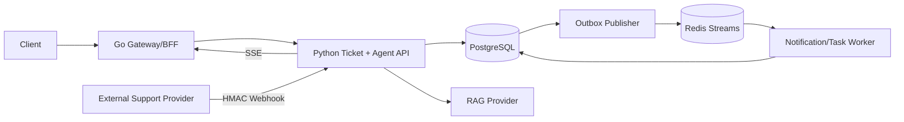

# 综合项目架构



## Owner 边界

- Ticket/Agent Service 是工单、消息、任务和 Outbox 的唯一写 owner；
- Gateway 负责外部协议和身份，不写业务表；
- Worker 通过 owner Repository/命令应用状态；
- Redis 中的数据必须可由 PostgreSQL 或外部事实重建；
- RAG 文档需要独立 owner、版本和租户权限。

## 创建工单事务

```text
验证身份与输入
→ 占用 idempotency key
→ INSERT ticket
→ INSERT ticket.created outbox
→ 保存可重放响应
→ COMMIT
→ 返回 201
```

如果 COMMIT 后响应丢失，客户端使用相同 idempotency key 重试并得到同一业务结果。

## Webhook 事务

```text
读取原始字节
→ 校验时间窗 + nonce + HMAC
→ INSERT webhook_event（唯一 provider/event_id）
→ 检查实体版本/sequence
→ UPDATE ticket/message
→ INSERT outbox
→ COMMIT
→ 2xx
```

## Agent Task

```text
创建 pending task
→ Worker claim + lease
→ 权限过滤后的 RAG 检索
→ 模型/工具调用（deadline + budget）
→ 保存来源与结果
→ 写终态事件
→ SSE/事件查询恢复
```

## 需要主动证明的失败场景

- BFF 超时但 Ticket 已创建；
- 两个并发请求更新同一 version；
- Webhook 重复、乱序或签名错误；
- Outbox 发布后、标记 published 前宕机；
- Consumer 业务提交后、ACK 前宕机；
- Worker 租约过期后旧 Worker 回来写结果；
- Redis 全部丢失；
- RAG Provider 超时、无结果或返回越权文档；
- SSE 断开后客户端重新查询任务。
