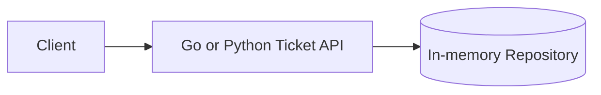
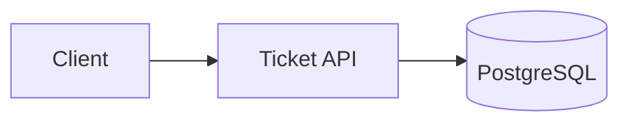
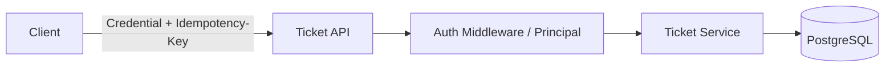
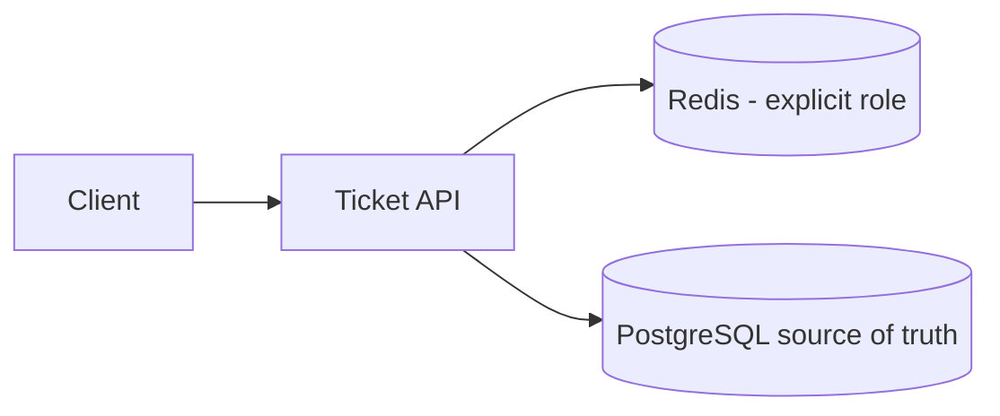
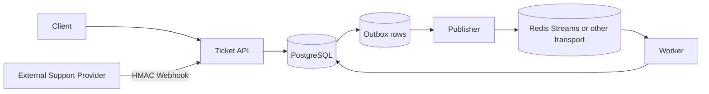
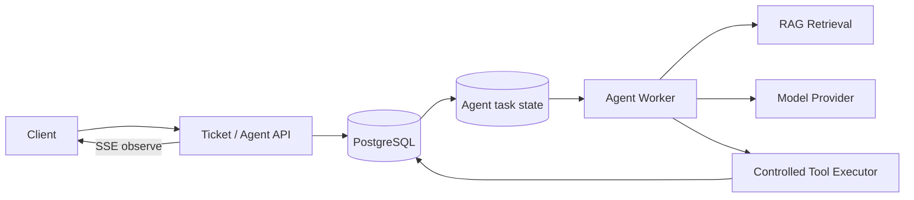
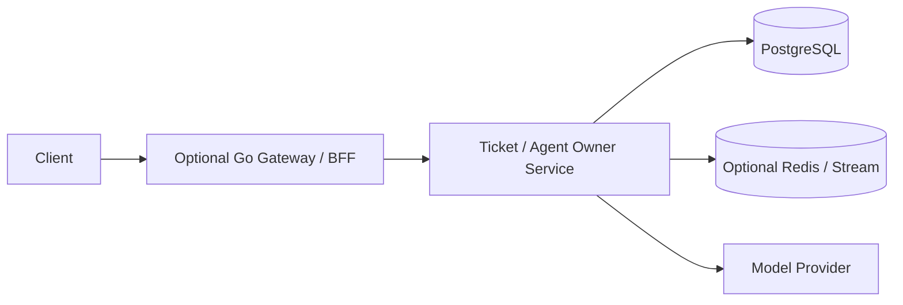
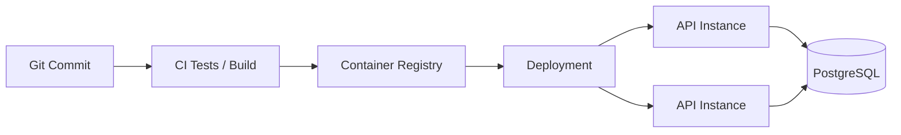

# 综合项目架构：不是一张终态图，而是一组可解释的演进

架构图只画最终形态，会隐藏最重要的学习过程：

> **为什么从一个简单 API 一步一步长成现在这样？**

本项目每个阶段都有一张最小架构。

---

# P0：单服务 + 内存



这一阶段只学习：

```text
HTTP
Middleware
Handler
Service
Repository
测试
```

限制：

```text
进程重启 -> 数据丢失
```

这个限制推导 P1。

---

# P1：PostgreSQL 事实源



PostgreSQL 成为工单事实源。

新增：

```text
schema
constraint
index
migration
connection pool
timeout
tenant query
```

仍然没有 Redis/Queue/Gateway。

---

# P2：正确性边界

架构组件变化不大：



但语义明显变强：

```text
Credential
→ Principal
→ owner/tenant authorization

Service
→ transaction
→ optimistic version
→ idempotency

PostgreSQL
→ UNIQUE / CHECK / tenant facts
```

这阶段说明一个重要事实：

> 架构能力不等于“组件数量”。很多关键可靠性来自 transaction、constraint 和 contract。

---

# P3：可选 Redis / 并发保护

只有选了具体 Redis 场景才出现：



如果 Redis 是 cache：

```text
Redis 丢失 -> 可回源 PostgreSQL
```

如果 Redis 是 session：

```text
Redis 丢失 -> 会话可失效，但业务工单事实仍在 PG
```

如果只是练 goroutine/worker pool，并不需要为了阶段编号强行加 Redis。

---

# P4：异步边界

业务需要可靠地触发后台工作后：



关键事实：

```text
PostgreSQL
= Ticket + Idempotency + Webhook dedupe + Outbox 的事实源
```

Redis Streams 只承担 message transport 时：

```text
Stream 全丢
```

仍可以从未完成 Outbox/事实恢复设计的范围内恢复，而不是让 Redis 成为唯一业务真相。

## 创建 Ticket

```text
validate principal/input
→ BEGIN
→ reserve idempotency key
→ INSERT ticket
→ INSERT outbox(ticket.created)
→ persist replayable result
→ COMMIT
→ return
```

关键故障：

```text
COMMIT 后 response 前崩溃
```

由 idempotency 处理。

## Outbox Publisher

```text
claim event
→ publish
→ mark published
```

关键故障：

```text
publish 成功
mark published 前崩溃
```

结果是可能重复 publish，因此 consumer 仍需幂等。

## Consumer

```text
receive
→ BEGIN
→ record event_id / apply business change
→ COMMIT
→ ACK
```

关键故障：

```text
COMMIT 后 ACK 前崩溃
```

消息重投，由 consumer idempotency 兜底。

---

# P5：Agent Task



任务不是靠 SSE connection 存活。

```text
PostgreSQL task state
= 事实

SSE
= 实时观察通道
```

Client 断线：

```text
Task 继续 / 按明确 cancel policy
Client 以后 GET task 恢复状态
```

## RAG 权限

```text
Principal
→ tenant/ACL retrieval filter
→ source candidates
→ model context
```

不能：

```text
全库 retrieval
→ Prompt 要模型不要泄露
```

## Tool

```text
Model proposes tool call
→ schema validation
→ authorization
→ tenant/owner
→ confirmation if needed
→ idempotency
→ execute
→ audit
```

Model 不拥有最终权限。

## Long-running Worker

```text
claim
→ lease
→ fencing/version
```

防止 stale Worker 在被接管后写旧结果。

---

# P6：可选网络边界

只有已经有明确理由时才拆：



拆开以后新增的不是“高级感”，而是：

```text
service-to-service auth
deadline propagation
network timeout
error mapping
retry amplification
trace propagation
version compatibility
independent deploy
```

因此 P6 的验收重点是：

> 能否解释这些新失败，而不是能否启动两个进程。

---

# 部署层是另一张图

应用架构和部署编排不要混成一张巨图。

当要练 Docker/K8s 时：



如果使用 Kubernetes：

```text
Deployment
→ Pods
→ Service
→ readiness/liveness
```

这解决运行实例管理，不改变 Ticket 的业务事实 owner。

---

# 架构不变量

无论进行到哪一阶段，保持这些原则：

1. **客户端身份声明不可信。** `user_id/tenant_id/role` 不能只因为来自 Body/Header 就信。
2. **PostgreSQL 是核心工单事实源。** Cache/Stream/Vector index 的角色必须明确。
3. **业务写入有唯一 owner。** 不因拆服务就允许大家随便写表。
4. **外部调用不假装能和数据库一起 rollback。** 跨系统失败显式处理。
5. **重复是正常故障模型。** HTTP retry、Webhook、message、Tool side effect 都考虑 idempotency。
6. **所有慢依赖有 deadline。** 并发有上限，队列有背压。
7. **Agent 不绕过普通后端安全。** Retrieval ACL、Tool authorization、audit 都是服务端职责。
8. **新增组件必须能解释收益和新故障。** 没有证据就不为了架构完整硬加。

---

# 架构评审时应该问什么

不要只问：

```text
这里为什么用 Redis？
```

继续问：

```text
Redis 的角色是什么？
Redis 全丢会怎样？
谁是 source of truth？
为什么 PostgreSQL 不够？
```

不要只问：

```text
为什么有 Gateway？
```

继续问：

```text
它解决哪个独立客户端/部署边界？
下游怎样验证调用来源？
谁做 authorization？
Gateway 挂了用户看到什么？
```

不要只问：

```text
Agent 用什么模型？
```

继续问：

```text
Tool 有什么权限？
模型 timeout 怎么办？
任务状态在哪？
Source ACL 在哪执行？
Side effect 重复怎么办？
```

架构图真正有价值的地方，是帮助你推演这些问题。
